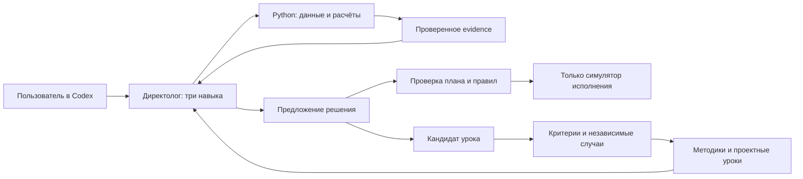

# Директолог v2.0 для Codex

Агент для анализа Яндекс Директа, подготовки рекламных решений и накопления
проверяемых проектных уроков. Три навыка отвечают за рассуждения; Python-инструменты —
за интеграции, расчёты, состояние и проверки. Каждый пользователь создаёт свои проекты.

**Текущий выпуск: аналитический агент и локально проверенный контур контроля.
Изменение реальной рекламы отключено.** Исполнитель работает только с симулятором.
Это не готовый сервис круглосуточного автономного ведения кампаний.

## Что умеет

- Единый мастер подключения Директа, Метрики, Wordstat и отдельного CRM bridge.
  Ключи вводятся скрыто в терминале и хранятся в защищённом хранилище ОС.
- Получение read-only отчётов Директа, Метрики и CRM bridge; проверка периода,
  цели, контекста, полноты и срока годности; расчёты через Decimal.
- Диагностика рекламы, семантика и объявления через три project-local skills Codex.
  Факты, гипотезы, альтернативы и ограничения сохраняются в проверяемом предложении.
- Изолированные проектные данные, SQLite-журнал, резервные копии и восстановление.
- Проверка точных планов и ограничений на симуляторе, без слепого повтора после сбоя.
- Версии уроков с независимыми контрольными случаями, блокировкой регрессии и откатом.
  Автоматическое принятие требует заранее заданных критериев конкретного проекта.

Обучение пока использует импортированные результаты оценки: их независимое
происхождение не доказывается программой. Внешних рабочих моделей нет; контракт
переноса задач в AI Studio проверен на заглушках. Платный runner Wordstat отключён.
Реальные API каждого пользователя требуют отдельной проверки. [Матрица возможностей](docs/capability-matrix.md).

## Установка

Нужны Git, Python 3.12+ и Codex с поддержкой project-local skills.
Клонируйте **весь репозиторий**: навыки используют соседние `scripts/` и `knowledge/`.
Не устанавливайте отдельно одну папку skill.

```sh
git clone https://github.com/Sovetov-AS/directologist-v2.git
cd directologist-v2
python3 -m venv .venv
.venv/bin/python -m pip install -r requirements.txt
.venv/bin/python scripts/demo_cycle.py
```

В Windows PowerShell вместо последних трёх строк:

```powershell
py -3.12 -m venv .venv
.venv\Scripts\python.exe -m pip install -r requirements.txt
.venv\Scripts\python.exe scripts/demo_cycle.py
```

На Windows далее заменяйте `.venv/bin/python` на `.venv\Scripts\python.exe`.
`tzdata` устанавливается только в Windows: она нужна для IANA-часовых поясов.
Linux требует работающего Secret Service для хранения ключей; headless-сессия без
него не сможет пройти setup. Текстового хранилища в качестве замены нет.

Demo использует только синтетические данные и временную папку, не требует ключей,
не обращается к сети и удаляет свои данные после выполнения. Итог: `status: PASS`.

## Первый проект

Откройте клонированную папку как проект в Codex. Навыки находятся в `.agents/skills/`.
Для нового пользователя:

```sh
.venv/bin/python scripts/directologist.py --project my-project project-create --name 'Мой проект' --timezone Europe/Moscow
.venv/bin/python scripts/directologist.py --project my-project context
```

Напишите в Codex:

> Используй directologist. Настрой проект my-project, затем проверь рекламу и подготовь решение. Если данных недостаточно, перечисли необходимые данные.

Для ввода ключей запустите **в своём терминале**, не через чат:

```sh
.venv/bin/python scripts/directologist.py --project my-project setup
```

Мастер позволяет пропустить площадки и выбрать доступные ресурсы. Не передавайте
секреты в сообщения Codex, параметры команды, `.env` или файлы репозитория.
Проект создаётся без аккаунтов, бюджета и разрешений на рекламные изменения.
Успешная проверка каталога не подтверждает все операции API.

## Устройство



- `.agents/skills/` — главный directologist, спрос и объявления.
- `knowledge/` — методики, источники и синтетические примеры.
- `scripts/directologist/` — детерминированные инструменты и контракты.
- `projects/<id>/` — только локальные данные пользователя, исключены из Git.
- `tests/` — проверки на временных данных и подменённых API.

Профили разделяют контекст работы, но не изолируют друг от друга процессы с
доступом к файловой системе. Процесс с произвольным shell может изменить код и
политику. Поэтому права на реальную рекламу в этом выпуске не выдаются.

## Документация и проверки

[Подключения](docs/connections.md) · [Аналитика](docs/analysis.md) ·
[Предложение решения](docs/decision-contract.md) · [Планы и правила](docs/policy-proposal.md) ·
[Обучение](docs/learning-policy-proposal.md) · [Эксплуатация и восстановление](docs/runbook.md)

```sh
.venv/bin/python -B -m unittest discover -s tests -p 'test_*.py' -v
.venv/bin/python -B scripts/demo_cycle.py
.venv/bin/python -m pip check
```

CI проверяет Python 3.12 на macOS, Linux и Windows. Результаты CI подтверждают
локальный код; native хранилища секретов и реальные рекламные аккаунты в CI
не проверяются. POSIX-проверка скрытого ввода пропускается в Windows.

Остановка Codex **не останавливает показы в Директе**. Резервная копия SQLite
не включает ключи, профиль и JSON-артефакты; см. runbook.
Ни тесты, ни симуляция не доказывают достижение CPL или качества лидов.

## Лицензия

[MIT](LICENSE). Можно использовать, изменять и распространять с сохранением
уведомления об авторских правах и текста лицензии. Условия API площадок действуют отдельно.
