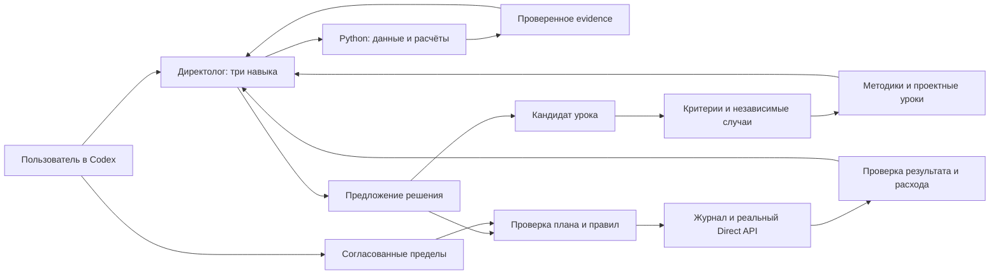

# Директолог v2.0 для Codex

Агент Codex, который создаёт и ведёт поисковую рекламу в Яндекс Директе
в пределах правил пользователя. Три навыка отвечают за решения, спрос и объявления;
Python — за API, расчёты, бюджеты и журнал действий. Отдельный сервер не нужен.

**Версия 0.2.0: реальный исполнитель Direct API доступен после подключения
кабинета и однократного согласования DirectGrant.** Внутри допуска Codex действует
сам, исключения выносит владельцу. Новый проект создаётся без разрешений и расходов.

## Что умеет

- Создаёт ЕПК для поиска с ручными ставками: кампанию, группы, ключи,
  автотаргетинг и адаптивные объявления; отправляет на модерацию и запускает
  после принятия объявлений. Сборка продолжается с сохранённого шага.
- Меняет ставки и бюджеты, ключи, тексты и минус-фразы; приостанавливает и
  возобновляет показы. Каждый шаг проверяет кабинет, область допуска и живое состояние.
- Читает статистику по ключам и поисковым запросам, сверяет отчёты Директа,
  Метрики и CRM bridge. Код считает деньги; Codex оценивает достаточность данных.
- Контролирует расход, срок и конфигурацию при каждом цикле; пытается остановить
  кампании при исчерпании лимита, неизвестном расходе или нарушении правил.
- Подключает площадки одним мастером: ключи вводятся скрыто и хранятся в хранилище ОС.
- Сохраняет решения, журнал API-операций и проектные уроки с проверками и откатом.
  При потерянном ответе не повторяет запись вслепую.

**Граница выпуска:** автоматизированы поисковые ЕПК с ручной стратегией.
РСЯ, автоматические стратегии и удаление объектов этим исполнителем не поддержаны.
Решения принимает Codex: команда `direct cycle` сама по себе не является моделью
оптимизации. Постоянное ведение использует расписание Codex на включённом компьютере.
Отчёты запаздывают; лимит расходов не является гарантией мгновенного ограничения
списаний. Реальные API-операции реализованы, но приёмка на живом аккаунте не проведена.

Обучение использует версионированные уроки и импортированные результаты оценки;
программа не доказывает независимость оценщика. Платный runner Wordstat и исполнение
моделями AI Studio пока не подключены. [Матрица возможностей](docs/capability-matrix.md).

## Установка

Нужны Git, Python 3.12+ и Codex с поддержкой project-local skills.
Клонируйте **весь репозиторий**: навыки используют соседние `scripts/` и `knowledge/`.
Не устанавливайте отдельно одну папку skill.

```sh
git clone https://github.com/Sovetov-AS/directologist-v2.git
cd directologist-v2
python3 -m venv .venv
.venv/bin/python -m pip install -r requirements.txt
.venv/bin/python scripts/demo_autonomy.py
```

В Windows PowerShell вместо последних трёх строк:

```powershell
py -3.12 -m venv .venv
.venv\Scripts\python.exe -m pip install -r requirements.txt
.venv\Scripts\python.exe scripts/demo_autonomy.py
```

На Windows далее заменяйте `.venv/bin/python` на `.venv\Scripts\python.exe`.
`tzdata` устанавливается только в Windows: она нужна для IANA-часовых поясов.
Linux требует работающего Secret Service для хранения ключей; headless-сессия без
него не сможет пройти setup. Текстового хранилища в качестве замены нет.

Demo использует только синтетические данные и временную папку, не требует ключей,
не обращается к сети и удаляет свои данные после выполнения. Итог: `status: PASS`.

## Первый проект

Откройте клонированную папку как проект в Codex. Навыки находятся в `.agents/skills/`.
Для нового пользователя:

```sh
.venv/bin/python scripts/directologist.py --project my-project project-create --name 'Мой проект' --timezone Europe/Moscow
.venv/bin/python scripts/directologist.py --project my-project context
```

Напишите в Codex:

> Используй directologist. Настрой проект my-project. Собери предложение, согласуй со мной бюджет, срок и правила, затем сам создай и веди поисковую рекламу. Спрашивай об исключениях.

Для ввода ключей запустите **в своём терминале**, не через чат:

```sh
.venv/bin/python scripts/directologist.py --project my-project setup
```

Мастер позволяет пропустить площадки и выбрать доступные ресурсы. Не передавайте
секреты в сообщения Codex, параметры команды, `.env` или файлы репозитория.
Проект создаётся без аккаунтов, бюджета и разрешений на рекламные изменения.
Успешная проверка каталога не подтверждает все операции API. После подключения
Codex подготовит конкретные правила и покажет их для согласования. Дальше следуйте
[рабочему процессу автономного ведения](docs/autonomy.md). JSON-файлы готовит агент,
пользователю достаточно описать бизнес и согласовать пределы.

## Устройство



- `.agents/skills/` — главный directologist, спрос и объявления.
- `knowledge/` — методики, источники и синтетические примеры.
- `scripts/directologist/` — детерминированные инструменты и контракты.
- `projects/<id>/` — только локальные данные пользователя, исключены из Git.
- `tests/` — проверки на временных данных и подменённых API.

Профили разделяют контекст работы, но не изолируют друг от друга процессы с
доступом к файловой системе. Процесс с произвольным shell может изменить код и
политику. Это осознанный режим trusted-local: пользователь доверяет Codex и локальному коду;
проверки ограничивают обычный рабочий процесс, а не произвольный shell того же владельца.

## Документация и проверки

[Подключения](docs/connections.md) · [Аналитика](docs/analysis.md) ·
[Предложение решения](docs/decision-contract.md) · [Автономное ведение и правила](docs/autonomy.md) ·
[Обучение](docs/learning-policy-proposal.md) · [Эксплуатация и восстановление](docs/runbook.md)

```sh
.venv/bin/python -B -m unittest discover -s tests -p 'test_*.py' -v
.venv/bin/python -B scripts/demo_cycle.py
.venv/bin/python -B scripts/demo_autonomy.py
.venv/bin/python -m pip check
```

CI проверяет Python 3.12 на macOS, Linux и Windows. Результаты CI подтверждают
локальный код; native хранилища секретов и реальные рекламные аккаунты в CI
не проверяются. POSIX-проверка скрытого ввода пропускается в Windows.

Остановка Codex **не останавливает показы в Директе**. Резервная копия SQLite
не включает ключи, профиль и JSON-артефакты; см. runbook.
Ни тесты, ни симуляция не доказывают достижение CPL или качества лидов.

## Лицензия

[MIT](LICENSE). Можно использовать, изменять и распространять с сохранением
уведомления об авторских правах и текста лицензии. Условия API площадок действуют отдельно.
