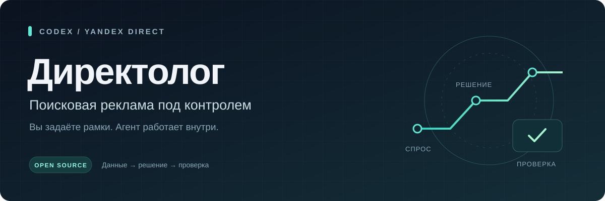
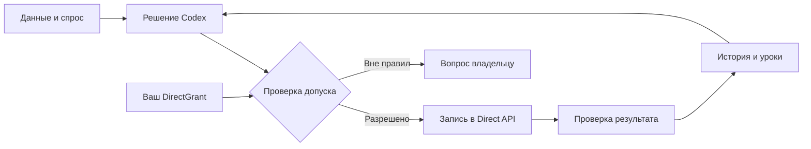

<p align="center">
  
</p>

<p align="center">
  <a href="https://github.com/Sovetov-AS/directologist-v2/actions/workflows/tests.yml"></a>
  
  <a href="LICENSE"></a>
  
</p>

<p align="center">
  <strong>Вы задаёте рамки. Агент ведёт рекламу.</strong><br>
  Поисковые кампании Яндекс Директа из Codex — с согласованными правилами,<br>
  проверкой изменений и памятью о результатах.
</p>

<p align="center">
  <a href="#quick-start">Быстрый старт</a> ·
  <a href="#how-it-works">Как работает</a> ·
  <a href="#boundaries">Границы автономности</a> ·
  <a href="#documentation">Документация</a>
</p>

---

## Реклама как управляемый процесс

Агент Codex, который создаёт и ведёт поисковую рекламу в Яндекс Директе
в пределах правил пользователя. Три навыка отвечают за решения, спрос и объявления;
Python — за API, расчёты, бюджеты и журнал действий. Отдельный сервер не нужен.

**Версия 0.2.0: реальный исполнитель Direct API доступен после подключения
кабинета и однократного согласования DirectGrant.** Внутри допуска Codex действует
сам, исключения выносит владельцу. Новый проект создаётся без разрешений и расходов.

Цель работы — оплаченные клиенты и экономика бизнеса, а не клики ради кликов.

| Возможность | Что это даёт |
| --- | --- |
| **Создание кампаний** | Поисковая ЕПК с ручными ставками: группы, ключи, автотаргетинг, адаптивные объявления, модерация и запуск после принятия объявлений. Сборка продолжается с сохранённого шага. |
| **Управление в пределах допуска** | Ставки, бюджеты, ключи, тексты, минус-фразы и статус показов. Каждый шаг проверяет кабинет, разрешения и живое состояние. |
| **Решения на основе данных** | Статистика и поисковые запросы, сверка Директа с Метрикой и CRM bridge. Код считает деньги; Codex оценивает достаточность данных. |
| **Контроль и история** | Проверка расхода, срока и конфигурации; попытка остановки при нарушении правил. Журнал операций и проектные уроки. Без слепого повтора записи при потерянном ответе API. |

<a id="boundaries"></a>
## Границы автономности

**Граница выпуска:** автоматизированы поисковые ЕПК с ручной стратегией.
РСЯ, автоматические стратегии и удаление объектов этим исполнителем не поддержаны.
Решения принимает Codex: команда `direct cycle` сама по себе не является моделью
оптимизации. Постоянное ведение использует расписание Codex на включённом компьютере.
Отчёты запаздывают; лимит расходов не является гарантией мгновенного ограничения
списаний. Корректировка поискового профиля остановленной кампании проверена на
живом аккаунте с контрольным чтением. Это не подтверждает все операции API,
создание новых кампаний или рекламную эффективность для других проектов.

<details>
<summary><strong>Исправление ручного бюджета и поискового профиля</strong></summary>

- Бюджет передаётся одним недельным параметром, без дублирования дневного.
- `campaign.search-profile` меняет даты и площадки остановленной кампании,
  допускает только сохранение или снижение бюджетов и требует отдельного разрешения
  в DirectGrant. После записи проверяется весь ожидаемый снимок, показы не включаются.
- В журнале ошибок сохраняются код и безопасные имена полей, без сырого ответа
  поставщика. Уточнены недельный резерв с явным НДС и ожидание готовности отчётов.

Подробности и ограничения: [автономный процесс](docs/autonomy.md).

</details>

Обучение использует версионированные уроки и импортированные результаты оценки;
программа не доказывает независимость оценщика. Платный runner Wordstat и исполнение
моделями AI Studio пока не подключены. [Матрица возможностей](docs/capability-matrix.md).

<a id="quick-start"></a>
## Быстрый старт

Нужны Git, Python 3.12+ и Codex с поддержкой project-local skills.
Клонируйте **весь репозиторий**: навыки используют соседние `scripts/` и `knowledge/`.
Не устанавливайте отдельно одну папку skill.

### 1. Установите и проверьте без подключения рекламы

```sh
git clone https://github.com/Sovetov-AS/directologist-v2.git
cd directologist-v2
python3 -m venv .venv
.venv/bin/python -m pip install -r requirements.txt
.venv/bin/python scripts/demo_autonomy.py
```

Demo использует только синтетические данные и временную папку, не требует ключей,
не обращается к сети и удаляет свои данные после выполнения. Итог: `status: PASS`.

<details>
<summary><strong>Windows и особенности хранения ключей</strong></summary>

В Windows PowerShell вместо последних трёх строк:

```powershell
py -3.12 -m venv .venv
.venv\Scripts\python.exe -m pip install -r requirements.txt
.venv\Scripts\python.exe scripts/demo_autonomy.py
```

На Windows далее заменяйте `.venv/bin/python` на `.venv\Scripts\python.exe`.
`tzdata` устанавливается только в Windows: она нужна для IANA-часовых поясов.
Linux требует работающего Secret Service для хранения ключей; headless-сессия без
него не сможет пройти setup. Текстового хранилища в качестве замены нет.

</details>

### 2. Создайте свой проект

Откройте клонированную папку как проект в Codex. Навыки находятся в `.agents/skills/`.
Для нового пользователя:

```sh
.venv/bin/python scripts/directologist.py --project my-project project-create --name 'Мой проект' --timezone Europe/Moscow
.venv/bin/python scripts/directologist.py --project my-project context
```

Напишите в Codex:

> Используй directologist. Настрой проект my-project. Собери предложение, согласуй со мной бюджет, срок и правила, затем сам создай и веди поисковую рекламу. Спрашивай об исключениях.

### 3. Подключите кабинет и согласуйте правила

Для ввода ключей запустите мастер **в своём терминале**, не через чат:

```sh
.venv/bin/python scripts/directologist.py --project my-project setup
```

Ключи вводятся скрыто и сохраняются в хранилище ОС.
Мастер позволяет пропустить площадки и выбрать доступные ресурсы. Не передавайте
секреты в сообщения Codex, параметры команды, `.env` или файлы репозитория.
Проект создаётся без аккаунтов, бюджета и разрешений на рекламные изменения.
Успешная проверка каталога не подтверждает все операции API. После подключения
Codex подготовит конкретные правила и покажет их для согласования. Дальше следуйте
[рабочему процессу автономного ведения](docs/autonomy.md). JSON-файлы готовит агент,
пользователю достаточно описать бизнес и согласовать пределы.

<a id="how-it-works"></a>
## Как работает


```mermaid
flowchart LR
    A[Данные и спрос] --> B[Решение Codex]
    B --> C{Проверка допуска}
    G[Ваш DirectGrant] --> C
    C -->|Разрешено| D[Запись в Direct API]
    C -->|Вне правил| U[Вопрос владельцу]
    D --> E[Проверка результата]
    E --> F[История и уроки]
    F --> B
```

**Память проекта, а не дообучение модели.** Уроки версионируются, проходят проверки
и могут быть откачены. Сохранённый опыт используется при следующих решениях.

<details>
<summary><strong>Что находится внутри репозитория</strong></summary>

- `.agents/skills/` — главный directologist, спрос и объявления.
- `knowledge/` — методики, источники и синтетические примеры.
- `scripts/directologist/` — детерминированные инструменты и контракты.
- `projects/<id>/` — только локальные данные пользователя, исключены из Git.
- `tests/` — проверки на временных данных и подменённых API.

</details>

Профили разделяют контекст работы, но не изолируют друг от друга процессы с
доступом к файловой системе. Процесс с произвольным shell может изменить код и
политику. Это осознанный режим trusted-local: пользователь доверяет Codex и локальному коду;
проверки ограничивают обычный рабочий процесс, а не произвольный shell того же владельца.

<a id="documentation"></a>
## Документация

| Задача | Руководство |
| --- | --- |
| Подключить сервисы и хранить ключи | [Подключения](docs/connections.md) |
| Согласовать правила и вести кампанию | [Автономный процесс и DirectGrant](docs/autonomy.md) |
| Понять метрики и экономику | [Аналитика](docs/analysis.md) |
| Проверить обоснование изменения | [Контракт решения](docs/decision-contract.md) |
| Разобраться с накоплением опыта | [Обучение и проектные уроки](docs/learning-policy-proposal.md) |
| Восстановиться после сбоя | [Эксплуатация и восстановление](docs/runbook.md) |

## Проверки

```sh
.venv/bin/python -B -m unittest discover -s tests -p 'test_*.py' -v
.venv/bin/python -B scripts/demo_cycle.py
.venv/bin/python -B scripts/demo_autonomy.py
.venv/bin/python -m pip check
```

CI проверяет Python 3.12 на macOS, Linux и Windows. Результаты CI подтверждают
локальный код; native хранилища секретов и реальные рекламные аккаунты в CI
не проверяются. POSIX-проверка скрытого ввода пропускается в Windows.

Остановка Codex **не останавливает показы в Директе**. Резервная копия SQLite
не включает ключи, профиль и JSON-артефакты; см. runbook.
Ни тесты, ни симуляция не доказывают достижение CPL или качества лидов.

---

**Открытый код · Локальные данные · Проверяемые действия**

[MIT](LICENSE). Можно использовать, изменять и распространять с сохранением
уведомления об авторских правах и текста лицензии. Условия API площадок действуют отдельно.
